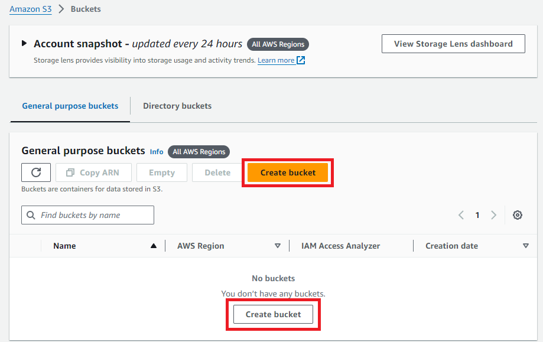

# CloudFront: Optimizing Web Performance with Amazon CloudFront and S3 Integration

## Overview
In this project, I learned to use Amazon CloudFront to accelerate content delivery and reduce latency for web applications by configuring an Amazon S3 bucket as the origin and setting up a CloudFront distribution, enabling faster delivery of static content through a global network of edge locations.

## Steps

1. **Prepare the Content**
   - I first downloaded a sample photo and saved it to a folder on my computer.
   - Within the AWS management console, I searched for the S3 service and opened the console.
   - Once in the S3 console, I clicked _Create bucket_.

   

2. ****
   - 

3. ****
   - 

4.****
   - 

## Resources
- [Use an Amazon CloudFront distribution to serve a static website](https://docs.aws.amazon.com/Route53/latest/DeveloperGuide/getting-started-cloudfront-overview.html)
