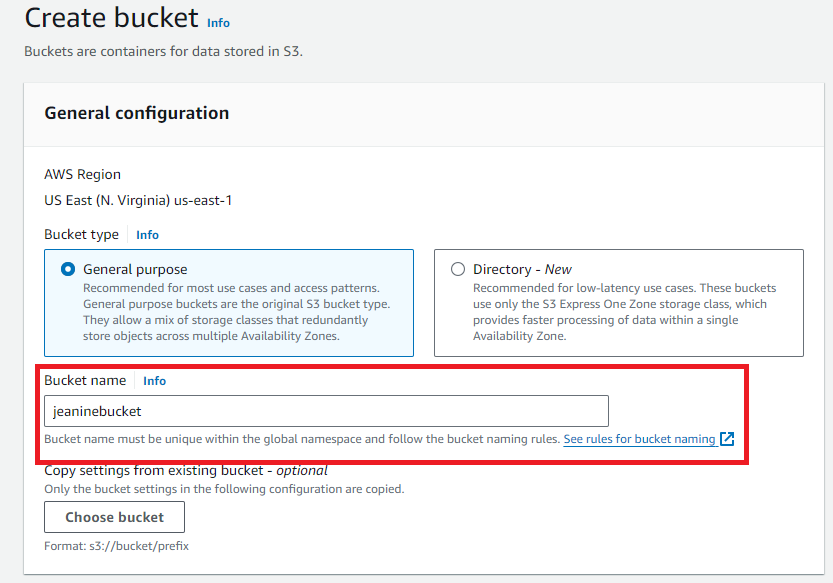
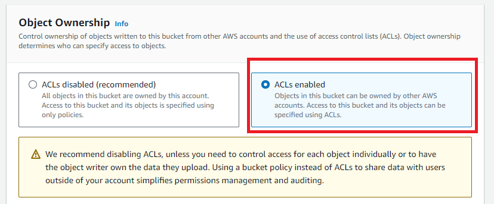
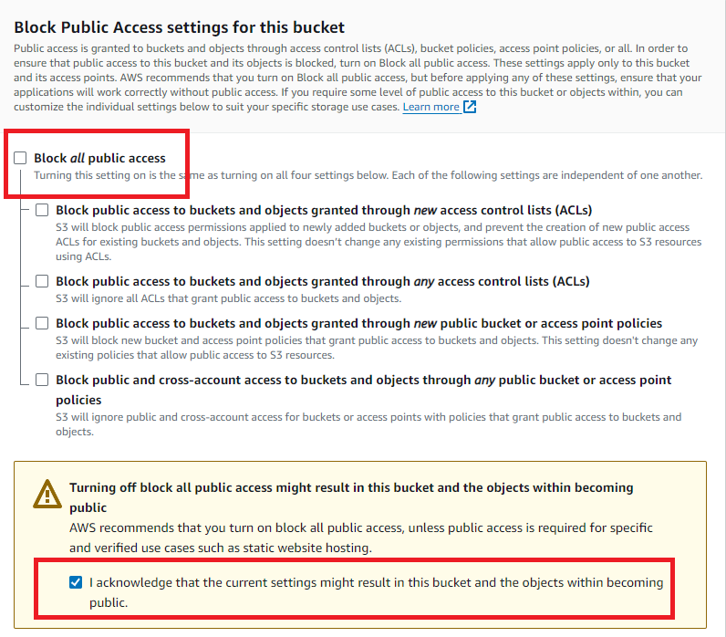
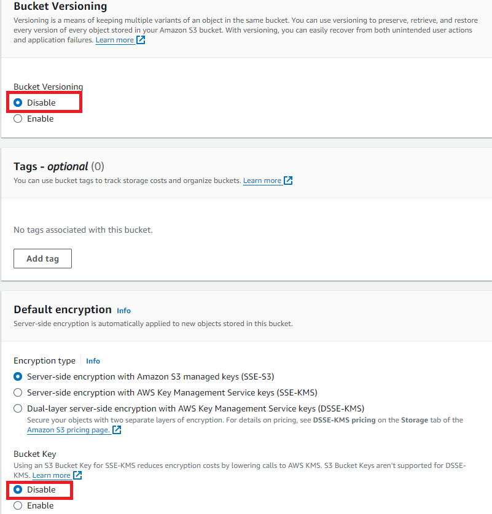
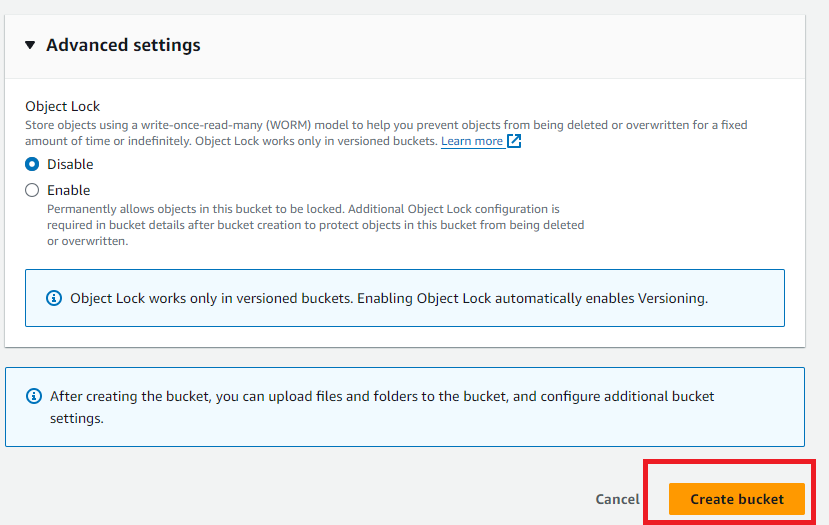
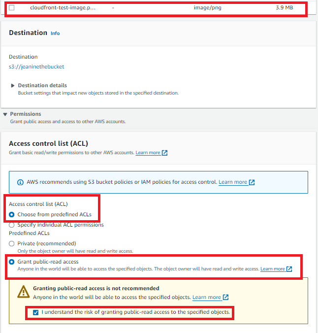

# CloudFront: Optimizing Web Performance with Amazon CloudFront and S3 Integration

## Overview
In this project, I learned to use Amazon CloudFront to accelerate content delivery and reduce latency for web applications by configuring an Amazon S3 bucket as the origin and setting up a CloudFront distribution, enabling faster delivery of static content through a global network of edge locations.

## Steps

1. **Prepare the Content**
   - I first downloaded a sample photo and saved it to a folder on my computer.
   - Within the AWS management console, I searched for the S3 service and opened the console.
   - Once in the S3 console, I clicked _Create bucket_.

   

   - When creating a bucket, I had to pick a unique S3 bucket name that has never been used before. In the image below, you'll see _jeaninebucket_. However, I had to go back and change it to _jeaninethebucket_ since the first name was already taken.

   

   - I then set the permission settings for my bucket. I made slight changes to the default settings. First, enabled ACLs under _Object Ownership_, then deselected the check box next to "Block all public access" under _Blcok Public Access settings for this bucket_, and, last, I disabled Bucket Versioning, Default encryption, and advanced settings.

   - To create the bucket, I clicked the orange _Create bucket_ button at the very bottom of the page.

   - Once the bucket is created, I clicked into it and then pressed the upload button to add my test file by dragging the test file image to the upload box.
   - I open the Permissions dropdown to select _Choose from predefined ACLs_, _Grant public-read access_, and then checked the “I understand the risk of granting public-read access to the specified objects” checkbox.

2. **Entering the CloudFront Console**
   - This step is as easy as it sounds: I searched for CloudFront in the search bar and then created a CloudFront distrobution.

3. ****
   - 

4. ****
   - 

## Resources
- [Use an Amazon CloudFront distribution to serve a static website](https://docs.aws.amazon.com/Route53/latest/DeveloperGuide/getting-started-cloudfront-overview.html)
